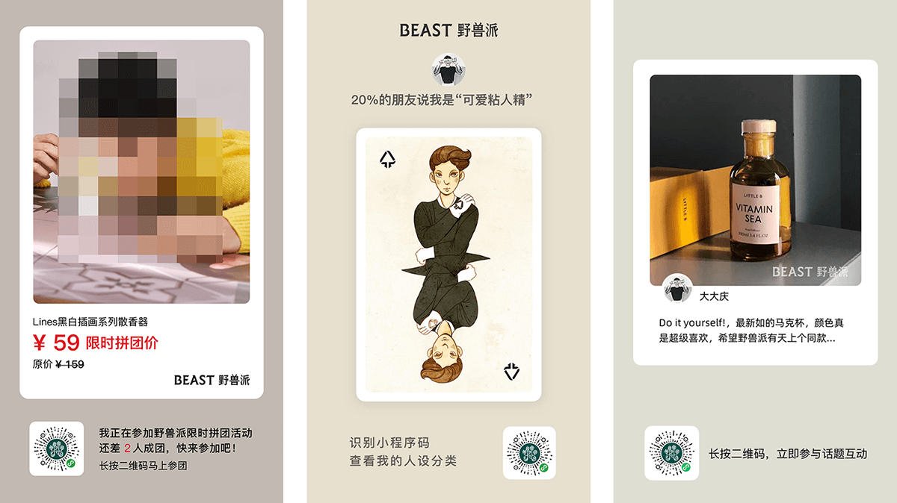

# 一. 新手介绍

## 1.1 项目背景

最近公司上了不少传播方面的需求，免不了合成各种营销图片，图片合成本身并不是什么高深的技术，但用底层api去搞确实繁琐，于是抽时间封装了一个小工具，初衷是解放生产力，后来发现挺好使，那就开源吧，花了一个整天重新整理了一下代码，作为自己从业十年第一个开源项目（打破零记录，哈哈），希望能够帮助到需要的小伙伴~

## 1.2 ImageCombiner能够做什么?

ImageCombiner是一个专门用于图片合成的工具，没有很复杂的功能，简单实用，从实际业务场景出发，提供简单的接口，几行代码即可实现图片拼合（当然用于合成水印也可以），素材上支持图片和文本两种，支持定位、缩放、圆角、透明度、颜色、字体、字号、删除线、居中绘制、文本自动换行等特性，足够覆盖图片合成的日常需求。

## 1.3 先看一下效果


## 1.4 UML


## 1.5 ImageCombiner怎么使用

ImageCombiner使用起来相当简单，主要的类只用一个，new一个ImageCombiner对象，指定背景图片和输出格式，然后加入各种素材元素，设置元素的位置、大小和效果（如圆角、颜色、透明度等），调用combine()方法即可。combine()方法直接返回BufferedImage对象，也可以调用getCombinedImageStream()获得流，方便上传oss等后续操作，或者调用save()方法保存到本地，调试的时候比较方便。

## 1.6 版本要求

项目不依赖任何框架，完全基于JDK本身编写，没有各种花里胡哨的东西，性能还是相当不错的。

# 二. 示例代码

## 2.1 安装
注意：合成图片若包含文字的话，开发机和服务器要先安装相应的字体，否则看不出效果，默认使用的字体为“阿里普惠”

在项目中加入以下依赖：
```xml
<dependency>
    <groupId>com.freeway</groupId>
    <artifactId>image-combiner</artifactId>
    <version>1.0.0</version>
</dependency>
```

最新版本为<font color=red>1.0.0</font>，目前还没有上传中央仓库（比较麻烦），请先自行deploy到自己的私库

## 2.2 最简单的例子
```java
public void simpleDemo() throws Exception {

    //合成器（指定背景图和输出格式，整个图片的宽高和相关计算依赖于背景图，所以背景图的大小是个基准）
    ImageCombiner combiner = new ImageCombiner("http://xxx.com/image/bg.jpg", OutputFormat.JPG);

    //加图片元素（居中绘制，圆角，半透明）
    combiner.addImageElement("http://xxx.com/image/product.png", 0, 300)
            .setCenter(true)
            .setRoundCorner(60)
            .setAlpha(.8f);

    //加文本元素，设置为红色
    combiner.addTextElement("周末大放送", 60, 100, 960).setColor(Color.red);

    //执行图片合并
    combiner.combine();

    //保存文件
    combiner.save("d://image.jpg");
```

## 2.3 完整示例

```java
public void demo() throws Exception {

    //图片元素可以是Url，也可以是BufferImage对象

    String bgImageUrl = "http://xxx.com/image/bg.jpg";                  //背景图
    String qrCodeUrl = "http://xxx.com/image/qrCode.png";               //二维码
    String productImageUrl = "http://xxx.com/image/product.jpg";        //商品图
    BufferedImage waterMark = ImageIO.read(new URL("https://xxx.com/image/waterMark.jpg")); //水印图
    BufferedImage avatar = ImageIO.read(new URL("https://xxx.com/image/avatar.jpg"));       //头像
    String title = "# 最爱的家居";                                       //标题文本
    String content = "苏格拉底说：“如果没有那个桌子，可能就没有那个水壶”";  //内容文本

    //合成器（指定背景图和输出格式，整个图片的宽高和相关计算依赖于背景图，所以背景图的大小是个基准）
    ImageCombiner combiner = new ImageCombiner(bgImageUrl, OutputFormat.JPG);

    //商品图（设置坐标、宽高和缩放模式，若按宽度缩放，则高度按比例自动计算）
    combiner.addImageElement(productImageUrl, 0, 160, 837, 0, ZoomMode.Width)
            .setRoundCorner(46)     //设置圆角
            .setCenter(true);       //居中绘制，会忽略x坐标参数，改为自动计算

    //标题（默认字体为阿里普惠、黑色，也可以自己指定Font对象）
    combiner.addTextElement(title, 55, 150, 1400);

    //内容（设置文本自动换行，需要指定最大宽度（超出则换行）、最大行数（超出则丢弃）、行高）
    combiner.addTextElement(content, "微软雅黑", 40, 150, 1480)
            .setAutoBreakLine(837, 2, 60);

    //头像（圆角设置一定的大小，可以把头像变成圆的）
    combiner.addImageElement(avatar, 200, 1200).setRoundCorner(200);

    //水印（设置透明度，0.0~1.0）
    combiner.addImageElement(waterMark, 630, 1200).setAlpha(.8f);

    //二维码（强制按指定宽度、高度缩放）
    combiner.addImageElement(qrCodeUrl, 138, 1707, 186, 186, ZoomMode.WidthHeight);

    //元素对象也可以直接new，然后手动加入待绘制列表
    TextElement textPrice = new TextElement("￥1290", 60, 230, 1300);
    textPrice.setColor(Color.red);          //红色
    textPrice.setStrikeThrough(true);       //删除线
    combiner.addElement(textPrice);         //加入待绘制集合

    //执行图片合并
    combiner.combine();
    //获取流（并上传oss等）
    InputStream is = combiner.getCombinedImageStream();
    //保存文件
    combiner.save("d://image.jpg");
}
```

## 2.4 代码截图


## 2.5 元素支持的特性
具体`ImageElement`和`TextElement`对象支持的特性如下表：

| 元素类型        | 特性    | 相关方法                                 |
| ---------      | ---------------------- | ----------------------------------------- |
| `ImageElement` | 图片     | `setImage()`,`setImgUrl()`              |
| `ImageElement` | 位置     | `setX()`,`setY()`                       |
| `ImageElement` | 缩放     | `setWidth()`,`setHeight()`,`ZoomMode`   |
| `ImageElement` | 圆角     | `setRoundCorner()`                      |
| `ImageElement` | 居中绘制 | `setCenter()`                           |
| `ImageElement` | 透明度   | `setAlpha()`                            |
| ----------------- |  |  |
| `TextElement`  | 文本     | `setText()`,`setY()`                    |
| `TextElement`  | 位置     | `setX()`,`setY()`                       |
| `TextElement`  | 居中绘制 | `setCenter()`                           |
| `TextElement`  | 透明度   | `setAlpha()`                            |
| `TextElement`  | 颜色     | `setColor()`                            |
| `TextElement`  | 字体     | `setFontName()`                         |
| `TextElement`  | 字号     | `setFontName()`                         |
| `TextElement`  | 删除线   | `setStrikeThrough()`                    |
| `TextElement`  | 自动换行 | `setAutoBreakLine()`                    |

## 2.6 后续计划
作者日常需求中已经够用了，各位小伙伴如果有额外的需求可以考虑再进一步扩充，如增加旋转、毛玻璃、艺术字等特效，欢迎加群交流


# 三. 联系作者

QQ群：706993679

邮箱：alexzchen@163.com


# 四. 项目协议

The MIT-996 License (MIT)

Copyright (c) 2020 Zhaoqing Chen


